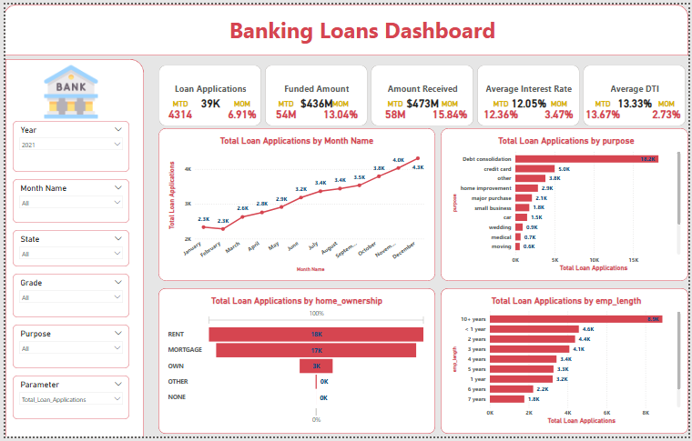
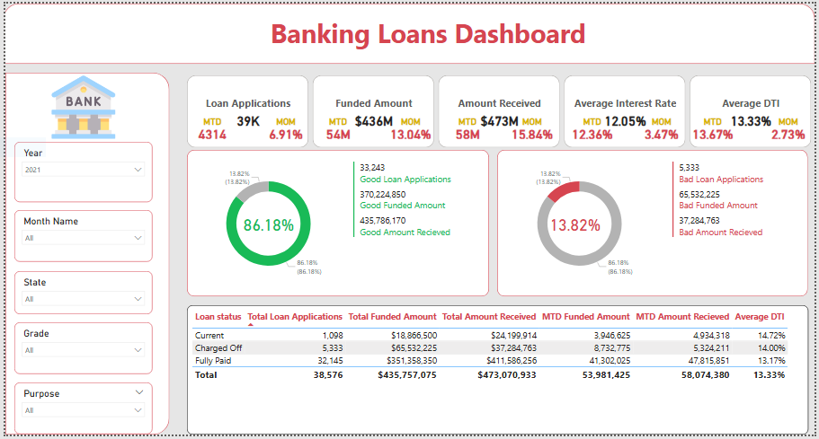
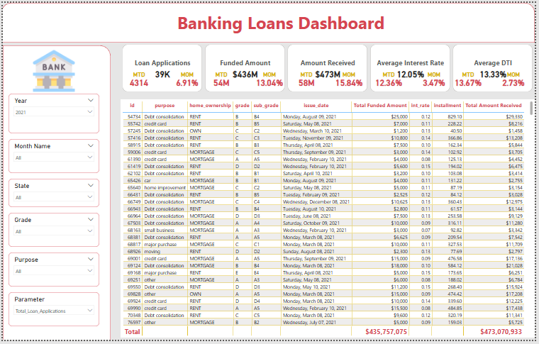

# 🏦 Bank Loan Analysis Dashboard (Power BI)

An interactive dashboard built in **Power BI** to analyze bank loan performance, track KPIs, and provide insights into loan portfolios, customer profiles, and repayment trends.

---

## 📊 Project Overview

This project aims to help financial institutions monitor and evaluate their loan performance efficiently.  
It provides real-time insights into **loan applications, funded amounts, repayments, and risk segmentation** using Time Intelligence DAX measures.

---

## 🎯 Objectives

- Analyze total loan applications, funded amounts, and received payments.
- Compare **Month-to-Date (MTD)** and **Month-over-Month (MoM)** trends.
- Distinguish between **Good Loans** and **Bad Loans**.
- Identify patterns by **Region, Loan Term, Purpose, and Home Ownership**.

---

## 🧩 Key Metrics (KPIs)

| Category | Metrics |
|-----------|----------|
| General | Total Loan Applications • Total Funded Amount • Total Amount Received |
| Financial Ratios | Average Interest Rate • Average Debt-to-Income Ratio (DTI) |
| Loan Segmentation | Good Loan % • Bad Loan % • Good/Bad Loan Applications and Funded Amounts |

---

## 🖼️ Dashboard Preview

| Overview | Good vs Bad Loans | Details Dashboard |
|-----------|------------------|------------------|
|  |  |  |

Each page highlights different aspects of loan performance:
1. **Overview:** Summary of KPIs and overall trends.  
2. **Good vs Bad Loans:** Segmentation of loan quality and repayment health.  
3. **Details Dashboard:** Full grid view of borrower details and loan statistics.

---

## 🧠 Insights Gained

- MTD and MoM trends show seasonal patterns in loan applications.  
- Majority of loans come from specific states with high-funded amounts.  
- Borrowers with longer employment history tend to have better repayment rates.  
- Good loans represent the majority share in total funding and repayments.

---

## 🛠️ Tools Used
- **Power BI**
- **DAX (Data Analysis Expressions)**
- **Excel / CSV Dataset**
- **Time Intelligence Functions**

---

## 📁 Dataset
Due to file size limitations, the dataset is hosted on Google Drive:
[🔗 Download Dataset](https://drive.google.com/file/d/1z87XG0INt_z-SyqgDyXolEN69Y-xe0Ab/view?usp=sharing)

---

## 👩‍💻 Author
*Rania Sami Mohamed Alwan*
_Data Analyst | Power BI | SQL | Excel_
